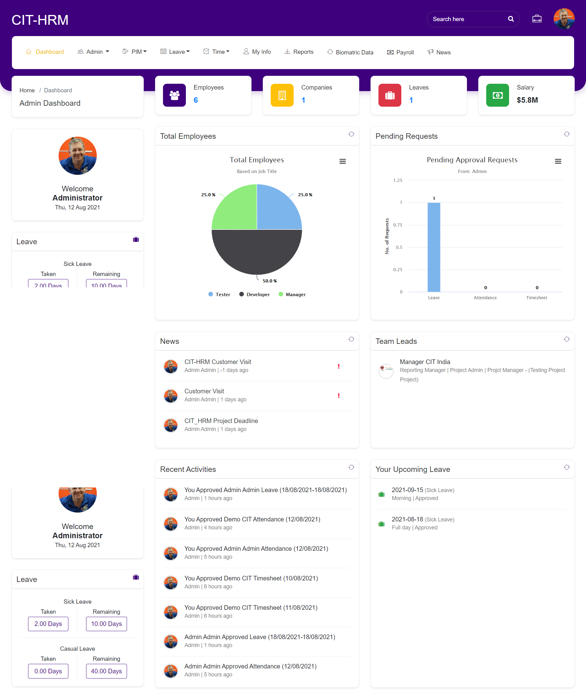

******************
Dashboard
******************

Click on “Dashboard”, It shows all Modules link in Nav Bar. Displays employees count, Companies count, Leaves Count of Logged in User. It also displays Total employees based on Job title in Pie chart and Pending leave requests in Bar chart. 
Dashboard also shows some fields like News Section, Team Leads Section, Recent Activities Section and Your Upcoming Leaves Section. All data displayed in this section is dynamic and displayed for time period or up to some status change. 
It also shows logged in user’s Leave data at left side. 

