********************
Leave Module
********************

------------------
Apply Leave
------------------
Click on Leave → “Apply Leave” to apply leave. At left side, balance leave details will be shown.
Select Leave type, From-To Date, Duration, enter Reason and click on “Apply” button to send leave request.

.. figure:: images/apply-leave-1.png

Note : If Admin applies leave, then it will be auto approved.
When manager applies, then it will go for Admin approval.
And when Employee applies, then if Manger is assigned to that employee, then   request will go to Manager for approval and once, he approves then it will go for Admin approval. If Manager is not assigned, then request directly goes for Admin approval.

---------------
My Leave
---------------
Click on Leave → “My Leave”, shows list of leave records applied by logged in employee. 

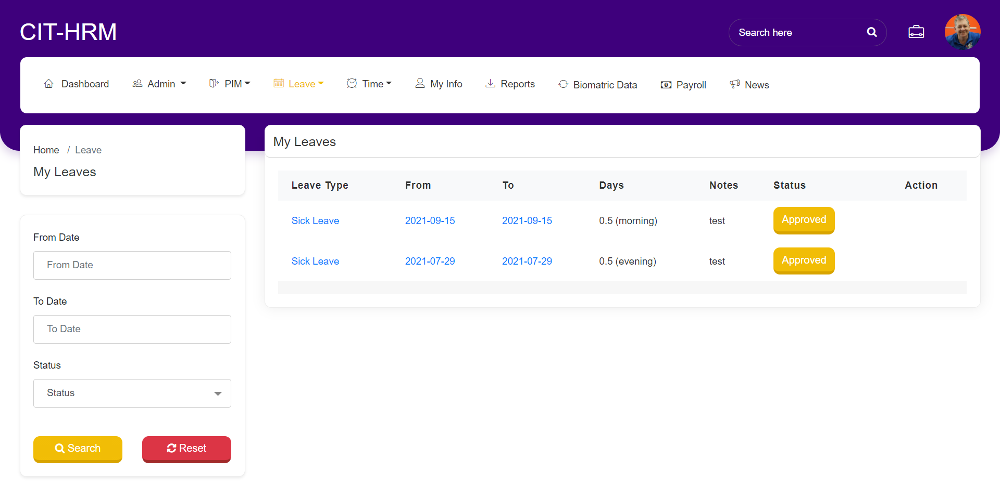

----------------
Entitlements
----------------
The Entitlements can be configured here, to Configure the Entitlements, the Leave Type and Leave period is mandatory to be added.

^^^^^^^^^^^^^^^^^^^
Add Entitlements
^^^^^^^^^^^^^^^^^^^
Once the employee is created, click on Leave →Entitlements→”Add Entitlement” to assign max allotted leave for an employee in a year.
Select Employee, Leave Type, Leave period will be displayed automatically from Leave period, enter Entitlements e.g. number of leave to above leave type. Then click on “Save” button to save the entitlement for that employee for the given period.
Entitlement can be assigned to multiple employees by selecting the checkbox of “Add to Multiple Employees”. By selecting check box, shows two dropdown fields of “location” and “Sub-unit”. So for that Location and Sub-unit Entitlements will be assigned.

Without selecting “Add to Multiple Employees” >> 

Selecting “Add to Multiple Employees” >> 

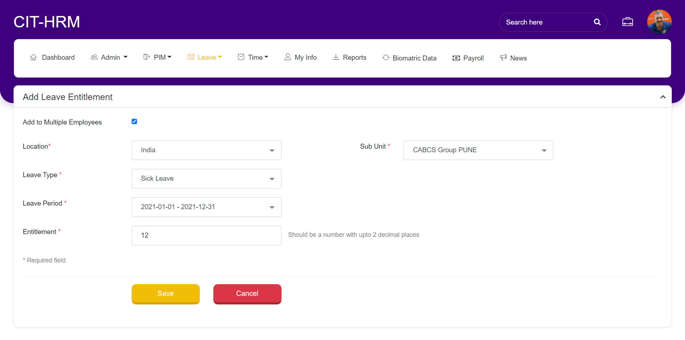

^^^^^^^^^^^^^^^^^^^^^^^^^^^^^^^^^
Employee Entitlements
^^^^^^^^^^^^^^^^^^^^^^^^^^^^^^^^^
Click on Leave → Entitlements → “Employee Entitlements” to check the entitlements of employees. Here it will list out the entitlements added to employees.

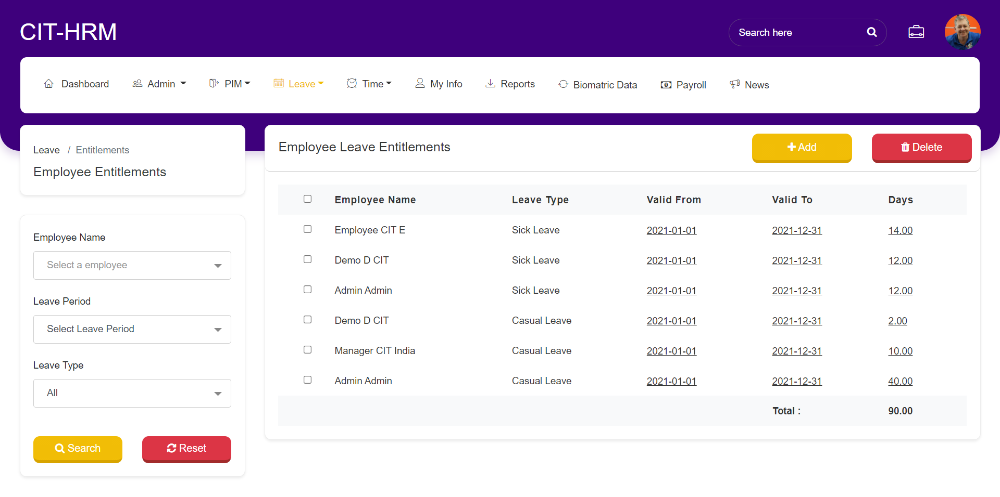

Click on “ADD” button will be navigated to “Add Entitlements” screen.

.. figure:: images/employee-entitlement-2.png

Single or multiple entitlements can be deleted by selecting check box and click on “Delete” button.

Employees details can be filtered by Employee Name, Leave Period and Leave Type.

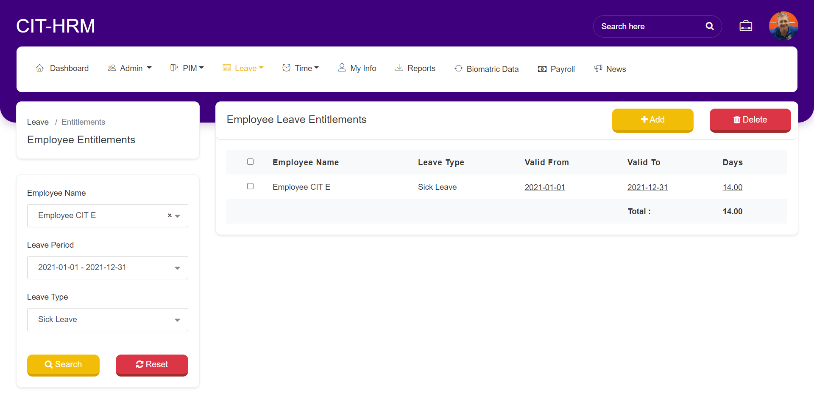

^^^^^^^^^^^^^^^^^^^^^^^^^^^^^^^^
My Entitlements
^^^^^^^^^^^^^^^^^^^^^^^^^^^^^^^^
Click on Leave → Entitlements → “My Entitlements”, shows current logged in employees entitlement details.
Click on “ADD” button will navigate to “Add Entitlements” screen.

Single or multiple entitlements can be deleted by selecting check box and click on “Delete” button.

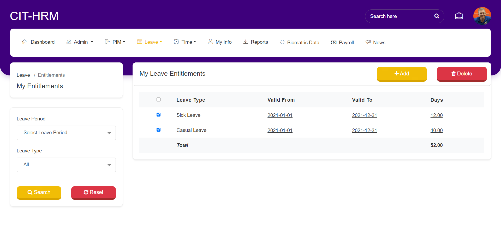

--------------------
Configuration
--------------------

^^^^^^^^^^^^^^^^^^^
Leave Period
^^^^^^^^^^^^^^^^^^^
Click on Leave → Configuration → “Leave Period“ to set the Leave Period for the Organization
Select Month, Date and  End date is calculated automatically. Current Leave period will be displayed below.

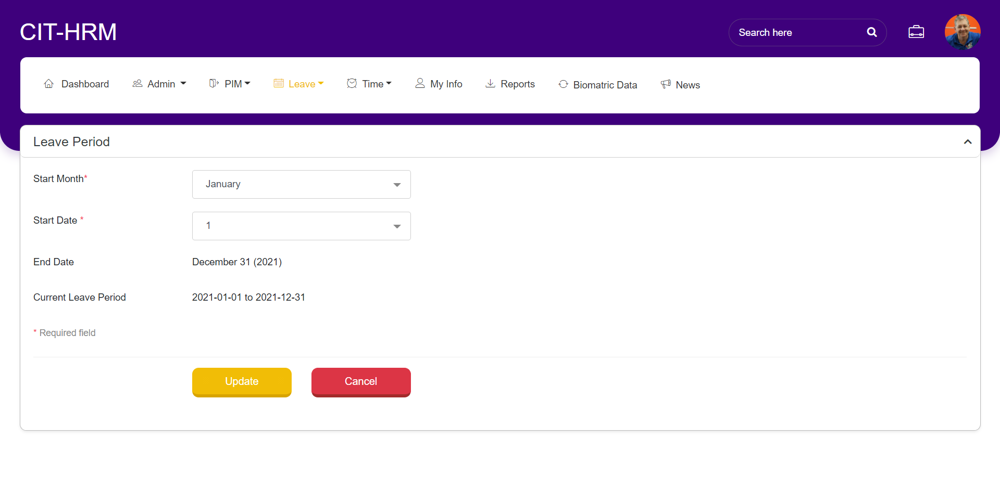

^^^^^^^^^^^^^^^^^
Leave Type
^^^^^^^^^^^^^^^^^
Click on Leave→Configuration→”Leave Types” to add Leave Types.
Click on “ADD” button, Enter Name & click on save button to save the new leave type to the organization.

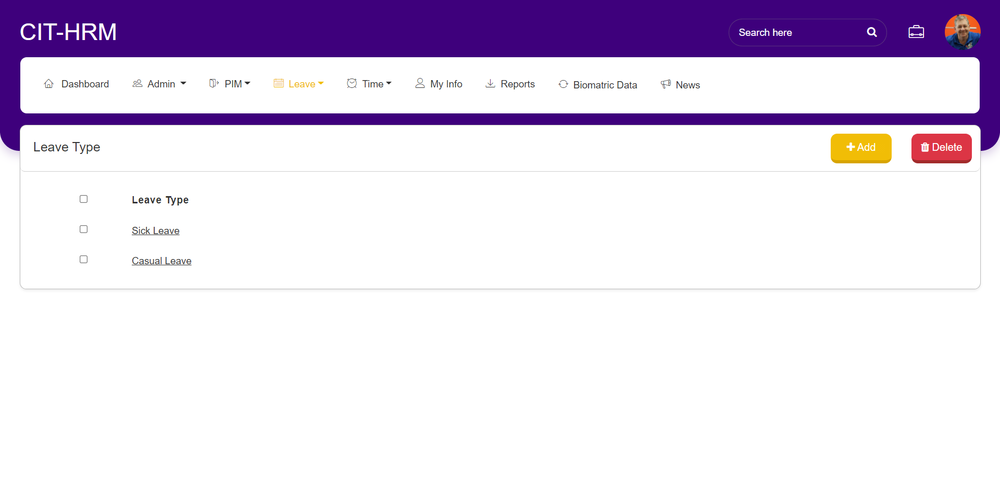

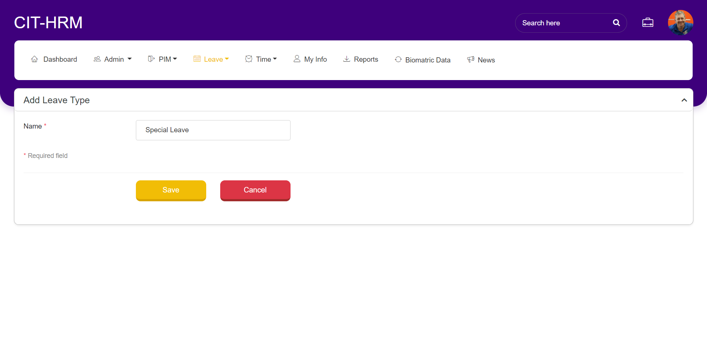

Click the checkbox and then click “Delete” button to delete the leave type.

^^^^^^^^^^^^^
Holidays
^^^^^^^^^^^^^
Click Leave→Configuration→”Holidays” to add new Holiday and check list of holidays.
Click “ADD” button to add new Holiday to organization.
Enter the Holiday Name, date, and click the checkbox Repeats annually if the holiday is mentioning is constant for all years (e.g.: Dec 25th, Jan 1st... etc.) also select full day / half day the holiday is valid and click save button to add the holiday to organization.
Click the checkbox and then click “Delete” button to delete the leave type.

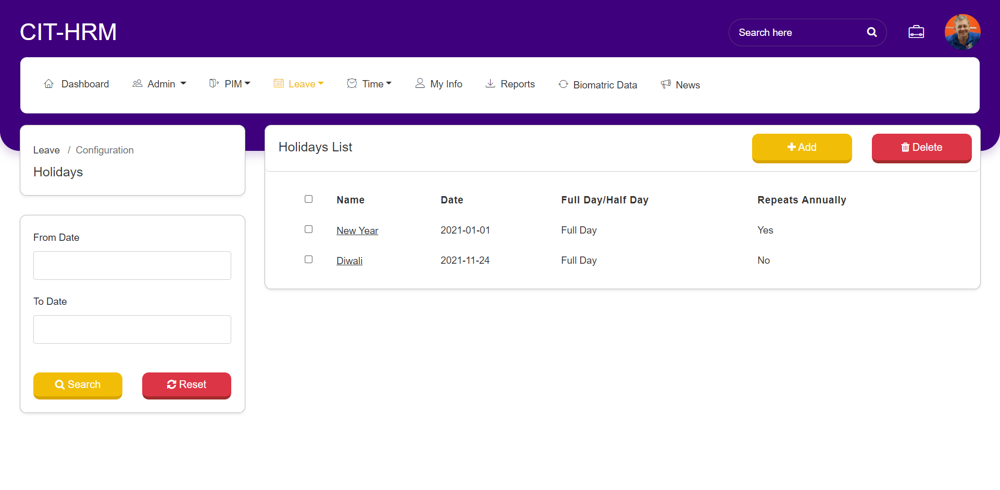
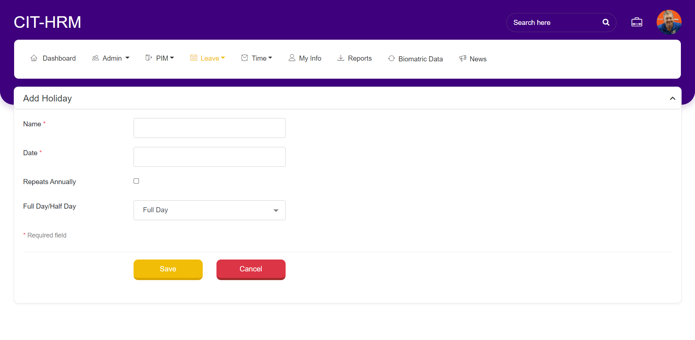

----------------
Leave list
----------------
Click on Leave →”Leave List” to check the employee leave status. Leave applied by the employee will be listed here for Approval process.
Leave has two levels of approval. If Employees has assigned Manager, then first Leave request will be sent to manager for approval. If Manager approves then it will be sent for Admin approval. If Manager Rejects or Cancels, then request will be sent back to Employees with Manager’s comments.
If Employee is not assigned Manager, then Leave request directly sent for Admin Approval.
Leave request can be filter by using search section at the left side.

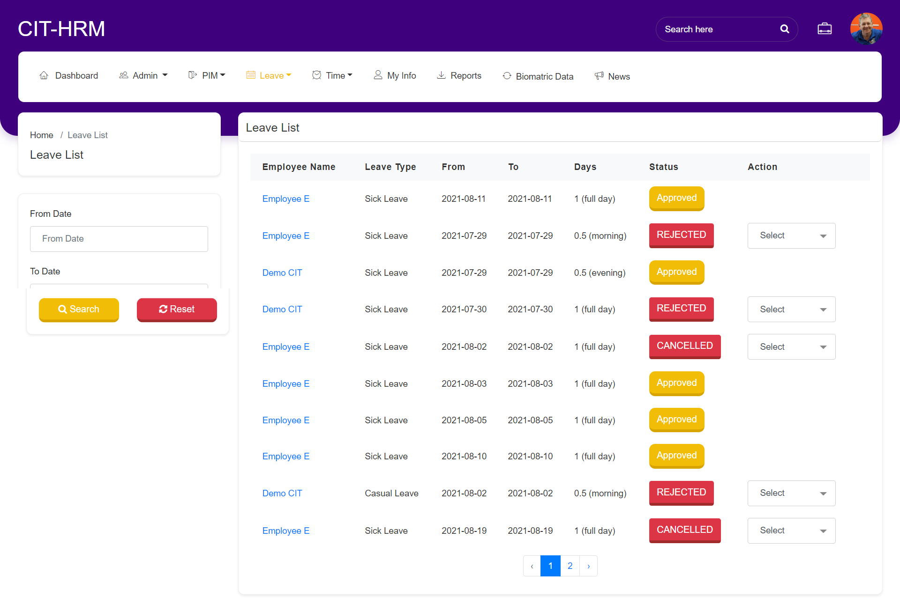

----------------
Assign Leave
----------------
Click on Leave → “Assign Leave”, Admin or Manager can apply leave on behalf of Employee.
Select Employee Name, Leave Type, From-To Date, Duration, and Enter Reason then click on “Apply” button to send Leave request.
If Manager applies Leave request on behalf of Employee, then it will be sent to Admin approval.
And If Admin applies Leave request on behalf of Employee, then it will be auto approved.

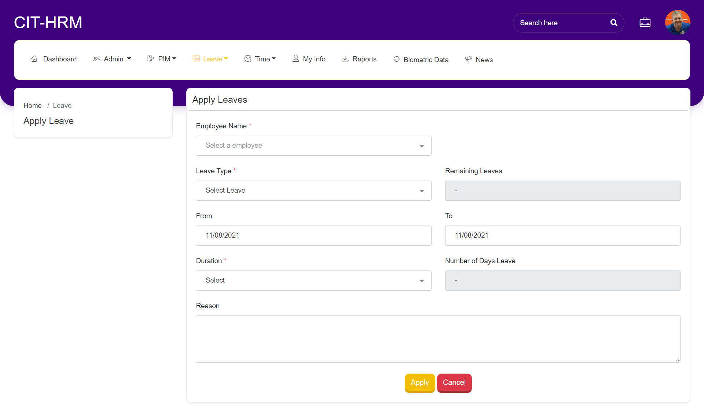