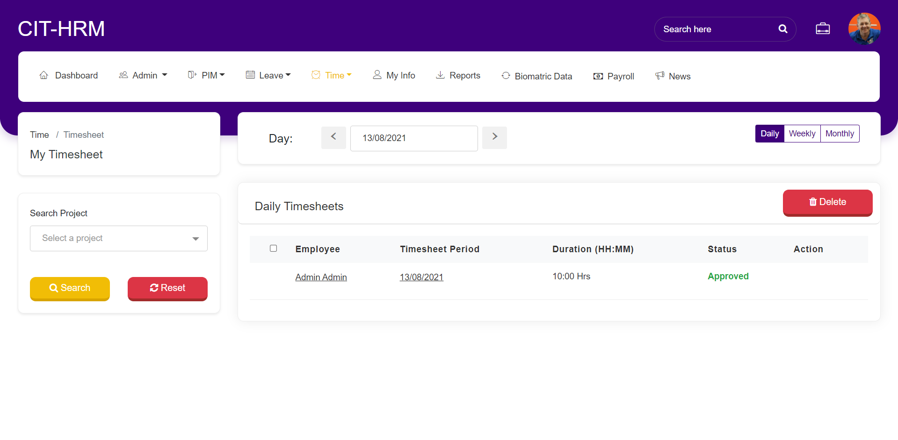

*********************
Time Module
*********************

-------------------
Timesheets
-------------------
The employee time sheets can be configured here, to Configure the time sheet the Project info and customer info is mandatory to be added.

^^^^^^^^^^^^^^^^^^^^^
My Timesheets
^^^^^^^^^^^^^^^^^^^^^
Click Time→ Timesheets →”My Timesheets” to Create timesheets and submit for approval.
By default, “Daily” tab will be set.

.. figure:: images/my-timesheet-1.png

Click on “ADD” button to add timesheet for that day. It will open Timesheet create screen.

.. figure:: images/add-timesheet-1.png

Select Project Name, Activity Name, Enter Duration, write Comments and if worked on multiple project or multiple tasks then click on “Add Row” to add those details. Then click on “Save” button to save the timesheet.

.. figure:: images/add-timesheet-2.png

Once Timesheet is saved, by default it will be in “Not Submitted” state.
Employees can submit for approval by clicking “Submit” button and it will be sent for approval.
For Timesheet, one level of approval is needed. If Employee is assigned with Manager, then request needs to be approved by Manager. If not, then request should be approved by Admin.
If Admin creates Timesheet and click on “Submit” button to send for approval, then it will be auto approved.

Timesheet can be deleted if the status is “Not Submitted” by clicking “Delete” Button.

^^^^^^^^^^^^^^^^^^^^^^^^^^
Employee Timesheets
^^^^^^^^^^^^^^^^^^^^^^^^^^
Click Time→ Timesheets →”Employee Timesheets” to view timesheets submitted by the employee.
List can display based on selection of “Daily/Weekly/Monthly” at right side.
Admin can perform action on it like Approve/Reject/Cancel.

.. figure:: images/employee-timesheet.png

Admin Approves Request >> 

-----------------------
Attendance
-----------------------
Employees daily attendance data will be configured here.

^^^^^^^^^^^^^^^^^^^^^
My Records
^^^^^^^^^^^^^^^^^^^^^
Click on Time → Attendance → “My Records”, lists attendance details here.
In “My records” data will be added from “Biometric Module” and “Punch IN/OUT” screen will be shown here.
If Records are added from “Biometric Data” then it will be listed with Type as “Automatic” and if listed from “Punch IN/OUT” then it will be listed as Type “Manual”.

Data can be filtered from filter section by selecting Date field and click on “Search” button.

^^^^^^^^^^^^^^^^^^^
Punch IN/OUT
^^^^^^^^^^^^^^^^^^^
If Punch IN/OUT details are not present in “Biometric Data” then Admin can enable this module for Employees to manually enter the Punch IN/OUT details and will be sent for one level of approval.
Admin can have full access so he can see this menu all the time.
Click Time → Attendance → “Punch IN/OUT” to enter punch In/Out details manually.
Select Date, enter Time and Note and then click on “Punch In” button. Once “Punch In” button is clicked then “Punch Out” Screen will be displayed.

.. figure:: images/punchIN-1.png

Click on “Punch In” to save details.

.. figure:: images/punchout-1.png

Enter Punch OUT details and click on “Punch OUT” button. And details are listed in My records screen. 

Click on “Punch Out” button to save details and navigates to My Records page.
If Admin creates attendance record, then it will be auto approved.
If Manager creates, then it will be sent for Admin approval.
If Employee creates, then it will be sent for Manager approval. If Manager is not assigned, then request sent to Admin approval.

^^^^^^^^^^^^^^^^^^^^
Employee Records
^^^^^^^^^^^^^^^^^^^^
Click on Time → Attendance → “Employee Record”, lists Punch IN/OUT records submitted by the Manager or Employees.
Admin can perform Approval operation here.
If Employee or Manager sent Attendance record for approval, then default status will be “Submitted” in Admin panel.

.. figure:: images/employee-records-1.png

Here Admin can perform Approval operation e.g. Approve or Reject. 

.. figure:: images/employee-records-2.png

Request can be filter or searched by Date.

.. figure:: images/employee-records-3.png

------------------------
Project Info
------------------------

^^^^^^^^^^^^^^^^^^^^^^^
Customers
^^^^^^^^^^^^^^^^^^^^^^^
Click on Time → Project Info → “Customers” to view the existing customer list.
Click on “ADD” button and enter the Name and Description and click on “Save” button to add the new Customer to the organization.

.. figure:: images/customers-2.png

Single or multiple Customers can be deleted by selecting check box and click on “Delete” button.

^^^^^^^^^^^^^^^^^
Projects
^^^^^^^^^^^^^^^^^
Click on Time → Project Info → ”Projects” to view the existing projects list.

Click on “ADD” button and enter the Customer’s Name, Project Name, Project Admin, Project Manager’s, Project Employees and Description and click on “Save” button to add the new project to the organization.

.. figure:: images/add-projects.png

After Adding Project, Project Activities can be added on click of “Project” on Project list screen.  It will open Project Edit Screen and below that Prokject Activities can be added.

.. figure:: images/projects-2.png

Click on “ADD” button to add project Activities.
Enter the Activity and click on “Save” button. And it will be listed in Activities Section.
Activity can be deleted by clicking on “Delete” button.

Single or multiple Projects can be deleted by selecting check box and click on “Delete” button.

.. figure:: images/projects-5.png
