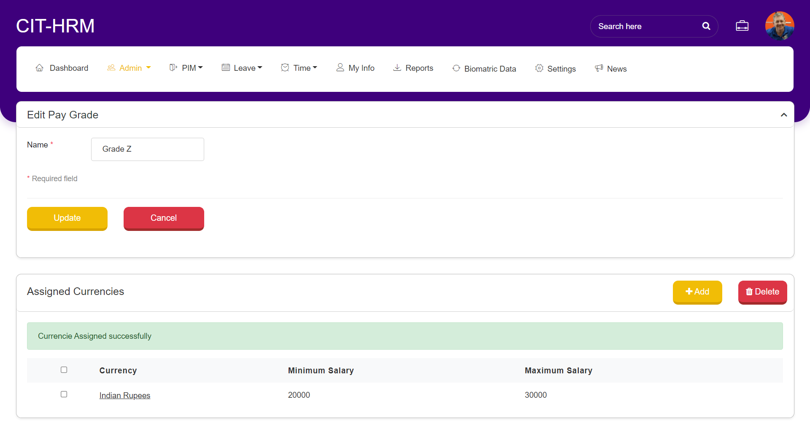
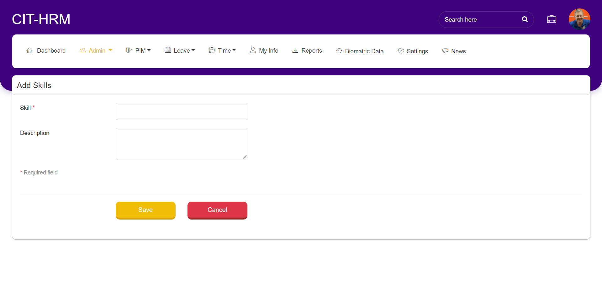
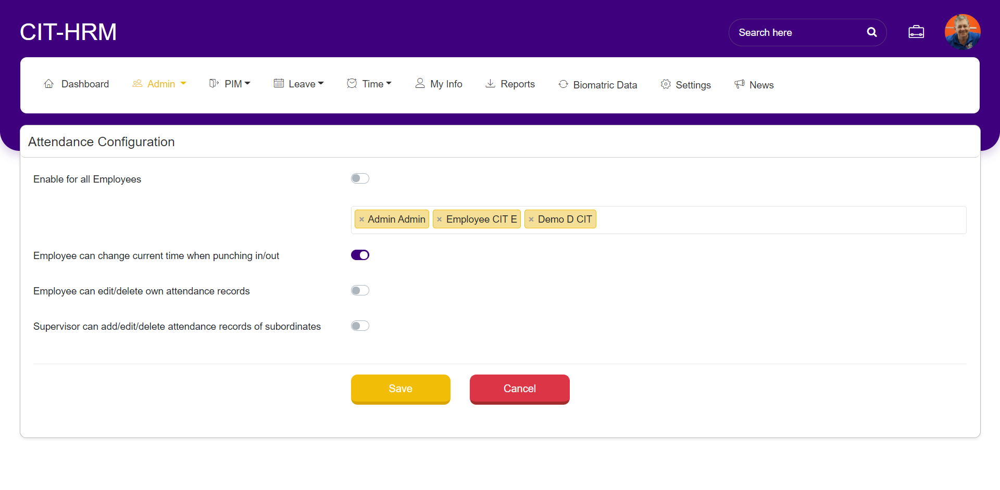

******************
Admin Module
******************
The Admin Module, the main point of control for the whole system. All administrative tasks such as configuring job titles, creating user accounts and many other system management tasks are performed on the Admin Module.

------------------
Organization
------------------
^^^^^^^^^^^^^^^^^^^^^^^^^^
General Information
^^^^^^^^^^^^^^^^^^^^^^^^^^
Click on Organization → “General Information" and click on edit to add the company details including company name, address, phone numbers, and Registration number. 

.. figure:: images/GeneralInformation.png

^^^^^^^^^^^^^^^^^^^
Locations
^^^^^^^^^^^^^^^^^^^
Click on Organizationà”Locations” to add the Organization locations.

Click on “ADD” button to add the Location and enter all details and click on Save.

.. figure:: images/location-2.png

------------------
Job 
------------------
^^^^^^^^^^^^^^^^^^
Job Title
^^^^^^^^^^^^^^^^^^

Click on Job → “Job” Titles to add the new titles for the employee.

.. figure:: images/job-1.png

Click on “ADD” button to add new Job Title. 
Enter Job title, Job description, Job specification, attachment if available, Note and click on save button.  

^^^^^^^^^^^^^^^^^
Pay Grades
^^^^^^^^^^^^^^^^^

Select Job → “Pay Grades” to check available Pay Grade if any or add new Pay Grade.

Click on “ADD” button to add new Pay Grades. 
Name and click on Save button

.. figure:: images/payGrades-2.png

After clicking Save button, “Assigned Currencies” tab will be enabled. 
Click on “ADD” button to assign currency to added grade.

.. figure:: images/payGrades-3.png

Enter Currency, Minimum Salary and Maximum Salary and Click on “Save” button.

^^^^^^^^^^^^^^^^^^^
Job categories
^^^^^^^^^^^^^^^^^^^
Select Job → “Job Categories” to add new Job Categories or list existing Job Categories if any.

Click “Add” button, enter the Category name and click on Save button to add the new job category to the organization.

----------------
User Management
----------------

In this Sub-Module, Admin will assign role to the added employee in PIM Module. 
Select Admin >> click on “User Management” to check the list of added employees. 

Click on “ADD” or  “Username” to assign role. Employee’s been added in PIM Module, will be listed here for role allocation like Employee, Manager or Admin.
While creating new Employee in PIM module, Login credentials can be created. If not created, then while assigning role Login credentials for that employee can be create. If credentials care created while Employee creation, then by mistake if Admin again creates while assigning role then previous credentials will be overwritten.
.. figure:: images/add-user-1.png
Single employee or multiple employees can be deleted by selecting check box and click on “Delete ” button.
.. figure:: images/user-management-2.png
Employee details can be searched by Employee Name or Role or Status.

----------------
Qualification
----------------

^^^^^^^^^^^^^^^
Skills
^^^^^^^^^^^^^^^
Select Admin >> Qualification >> “Skills” to add new skill or list existing skills if any.
.. figure:: images/skills-1.png

Click “ADD” button to add new Skill. Enter Skill and description then click on “Save” button.

Skills can be deleted by checking check box and click on “Delete” button. 

-----------------------------------
Punch IN/OUT Configuration
-----------------------------------
In this Sub-module, Admin can give access to employees for some modules if needed. 
Like , if attendance data is missing for some employee or for all employees then admin can enable that configuration then only Employees can see that menu.
