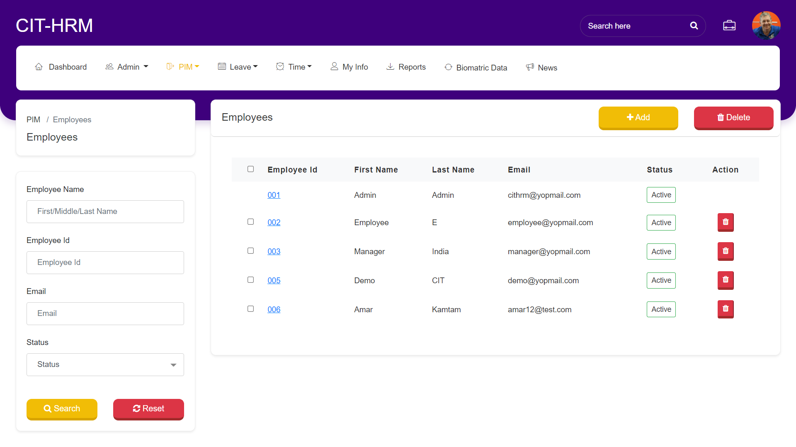
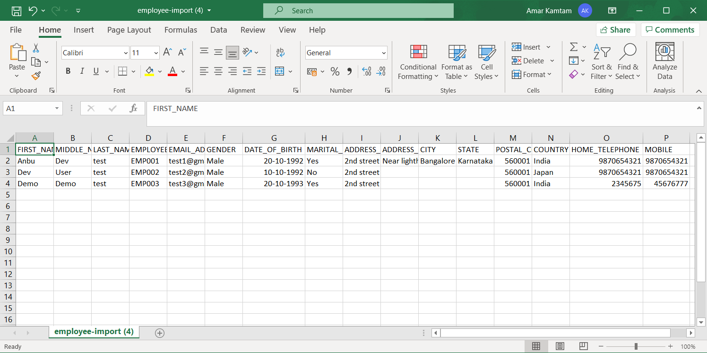
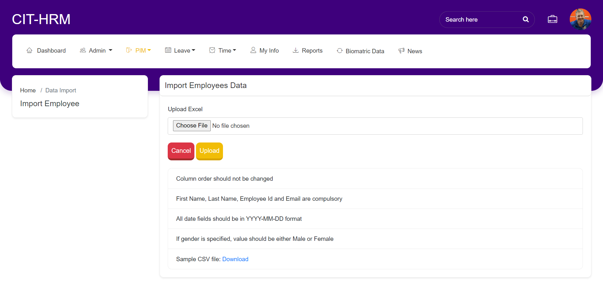
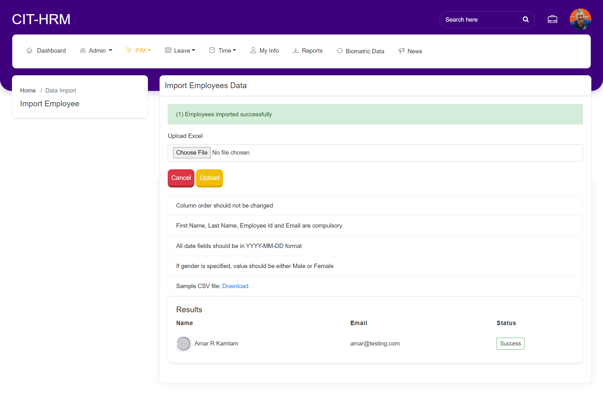

**********************
PIM
**********************

----------------------
Employee List
----------------------
Click on PIM >> “Employee List”. Once the employee is added the employee’s details will be displayed in the list.

Click on the “ADD” button to add new Employee.
Click on the checkbox next to the id to delete the employee from the employee list. Single and multiple deletion can be done by checking the check box.
Employee can be filter by using search section at left side.

--------------
Add Employee
--------------
Click on PIM → ”Add Employee” to add the new employee to the organization.
Click on the Create Login details check box and add the username, password and confirm password to create the login credentials to the employee created and click on Save button to add the employee to the organization. 
Add all details related to Job and Contact To and Report To.
.. figure:: images/add-employee.png

-----------------
Data import
-----------------
Click on PIM >> “Data import” to add multiple employee details through excel file.
The sample excel file link has been given on screen.
Upload File and click on “Upload” button to upload the Employees.
Sample File: 

Uploaded details will be displayed below.

